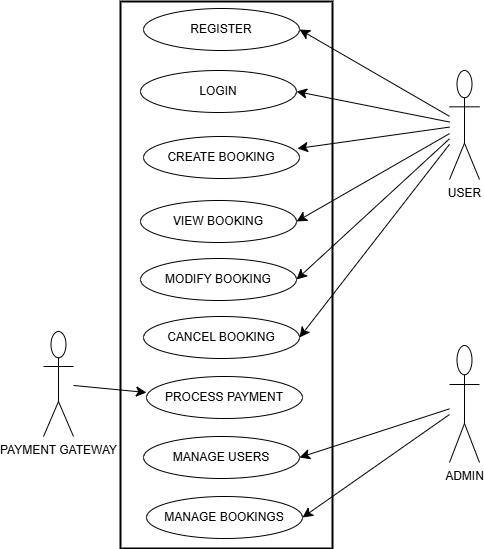

**Requirement Analysis in Software Development**
This repo explains everything entailing requirement analysis, the process and the importance of requirement analysis in SDLC

What is Requirement Analysis?
**Requirement Analysis** is the process of determining user expectations for a new or modified product. It involves understanding and documenting what is needed from a system or software application.
---
**Why is Requirement Analysis Important?**

**importance of requirement analysis**
Importance in the Software Development Lifecycle (SDLC)
**Foundation for Development** Requirements analysis forms the blueprint on which the entire development is based. This will help the developers have clear knowledge about what is to be developed, hence minimizing rework and thereby delaying the project.

**Clear-Cut Clarity and Precision** Accurate and precise analysis of the requirements will help in evading misunderstanding by the project team and uniformity of being on the same platform. The clarity thus gained helps set pragmatic expectations and timelines.

**Avoids Miscommunication** Clearly and elaborately defined requirements avoid miscommunication between stakeholders and the development team. This reduces the chances of errors in the final product and ensures it will meet the needs of the stakeholders.

**Improves Quality** Well-defined requirements lead to better design, development, and testing processes. This eventually leads to a high-quality product that meets user expectations and performs as intended.

**Cost and Time Efficiency** Early identification and fixation of potential issues during the requirement analysis phase save significant time and cost, as compared to identifying them later during the development process.

Three key reasons why Requirement Analysis is so important within the SDLC.

*Foundation for Development* 
Description: Requirement analysis gives the blueprint for all development. It ensures the developers clearly understand what to be developed, thus reducing chances of rework and delays to the project.The consequences are scope creep, misunderstanding, and misaligned expectations of the project, hence leading to inefficiency and increased cost.

*Clarity and Precision*
Description: With ample analysis and documentation of requirements, a project team may well avoid misunderstandings and keep all the parties on a mutual understanding. This clarity will help set realistic expectations and timelines.

Importance: Well-defined and clear requirements prevent misunderstandings between stakeholders and the development team by ensuring that the final product is what the stakeholders need.

*Improves Quality*

Description: Well-defined requirements ensure better design, development, and testing. This, in turn, results in a high-quality product, which will meet user expectations and perform as intended.

Importance: Good quality assurance is possible when the requirements are known and documented, hence less chance of defects, making the development process easier.

**Key Activities in Requirement Analysis**
Requirement Gathering: Collecting requirements from stakeholders through interviews, surveys, and workshops.

Requirement Elicitation: Engaging with stakeholders to draw out their needs and expectations.

Requirement Documentation: Writing down the requirements in a clear and structured manner.

Requirement Analysis and Modeling: Analyzing the requirements to ensure they are feasible and modeling them to visualize the system.

Requirement Validation: Ensuring the documented requirements meet the needs of stakeholders and are achievable.

**Types of Requirements**
**Functional Requirements** Define what the system should do (e.g., features, functions).
**Examples for Booking Management Project**

User Registration and Login

The system should provide a registration facility for users through email and password.

Users should be able to log in to the system using their registered credentials.

Booking Creation: The system should provide a facility for users to create a new booking, selecting date, time, and service.

Users should receive a confirmation email after successfully creating a booking.

Payment Processing: The system needs to be integrated with various payment gateways for secure processing of the payments.

Users will get a receipt via email when a payment is made.

Managing Bookings

Users shall be able to view, update, or cancel their bookings from their account dashboard.

The system shall send reminders regarding upcoming bookings to users.

**Non-Functional Requirements** Define how the system should perform (e.g., performance, security).
**Examples for Booking Management Project**

Performance

The system should support up to 1,000 concurrent users without any degradation in performance.

The page load time should not exceed 2 seconds under normal conditions of the load.

Security

The system shall use HTTPS in order to encrypt all data in transit between the client and the server.

User passwords shall be stored using strong hashing algorithms.

Usability

The system should be intuitive and user-friendly, with ease of navigation.

The system should be accessible to people with disabilities and follow the guidelines laid down by WCAG 2.1.

Scalability

The system shall be able to scale horizontally to handle increased user demand.

The architecture of the system shall allow easy addition of new features with minimal refactoring.
---

**Use Case Diagrams.**
**Use Case Diagrams** are a type of behavioral diagram defined by the Unified Modeling Language (UML). They represent the functional requirements of a system, showing the interactions between users (actors) and the system itself. These diagrams help visualize the different ways a user might interact with a system, making it easier to understand the system's functionality and the relationships between various use cases.

**Benefits of Use Case Diagrams**

Clarity: They provide a clear and concise way to capture and communicate the functional requirements of a system.

Visualization: They help visualize the interactions between users and the system, making it easier to identify and understand user needs.

Documentation: They serve as a useful documentation tool, capturing the functional requirements and interactions in a standardized format.

Communication: They facilitate better communication among stakeholders, developers, and designers by providing a common understanding of the system's functionality.

Requirement Validation: They help validate the requirements by ensuring that all possible interactions and use cases are considered.
--- 

identifying the objects
Use Case Diagram for Booking management System listing the actors and use cases

**Actors**

User: A person who uses the booking system to create and manage bookings.

Admin: A person who manages the system, including user accounts and bookings.

Payment Gateway: An external system that processes payments.

**Use Cases**

Register: Allows a user to create an account.

Login: Allows a user to log in to the system.

Create Booking: Allows a user to create a new booking.

View Booking: Allows a user to view their existing bookings.

Modify Booking: Allows a user to modify an existing booking.

Cancel Booking: Allows a user to cancel a booking.

Process Payment: Allows the system to process payments through the payment gateway.

Manage Users: Allows the admin to manage user accounts.

Manage Bookings: Allows the admin to manage all bookings.

---

**Acceptance Criteria**
Importance of Acceptance Criteria in Requirement Analysis

Acceptance Criteria are crucial in Requirement Analysis because they define the conditions that a feature should fulfill to be accepted by stakeholders. They act like clear and measurable standards to ensure that the developed feature meets the expectations and requirements of the stakeholders. Here are some key reasons why Acceptance Criteria are important:

Clarity and Precision

Acceptance Criteria detail the feature that is expected to be catered to. It presents clarity and precision in misunderstanding, and all stakeholders related to the feature are on the same page regarding the functionality aspect.

Validation and Verification
They provide a basis upon which the feature can be validated or verified. In return, once the Acceptance Criteria are met, they are proof that the development team has established the feature to work effectively to satisfy the needs of the stakeholders.

Scope Management

They help control the scope because one knows what is to be included and what is not, thus avoiding scope creep. They guarantee that the development team sticks to the implementation of agreed-upon functionality.

Quality Assurance

They offer some benchmark for quality assurance. Testers use the Acceptance Criteria to write test cases and ensure the feature meets the required standards before being accepted.

Stakeholder Satisfaction

The Acceptance Criteria are a surefire way for the development team to ensure that the feature addresses the needs and expectations of the stakeholders; this in turn enhances stakeholder satisfaction.

Sample Acceptance Criteria for the Checkout Feature in the Booking Management System:

Feature: Checkout

Acceptance Criteria

User Authentication

The system should allow checkout only when a user is logged in.

If the user is not logged in, the system should route him/her to the login page.

Booking Summary

The checkout page should show a summary of the booking, including service information, date, time, and total cost.

The user should be allowed to review and confirm the booking details before proceeding.

Payment Processing

The system shall integrate with the payment gateway for processing payments in a secure manner.

The user shall be able to select a payment method-e.g., credit card, PayPal-and enter payment details.

The system should always verify the payment details and then process the payment.

Confirmation

After successful payment, the system should prompt a confirmation message along with a booking reference number.

The user should receive a confirmation email regarding the booking details and the payment receipt.

Error Handling

If the payment is not successful, the system should flash an appropriate error message with options to retry the payment.

The system has to handle any errors elegantly and guide the user with sufficient instructions.